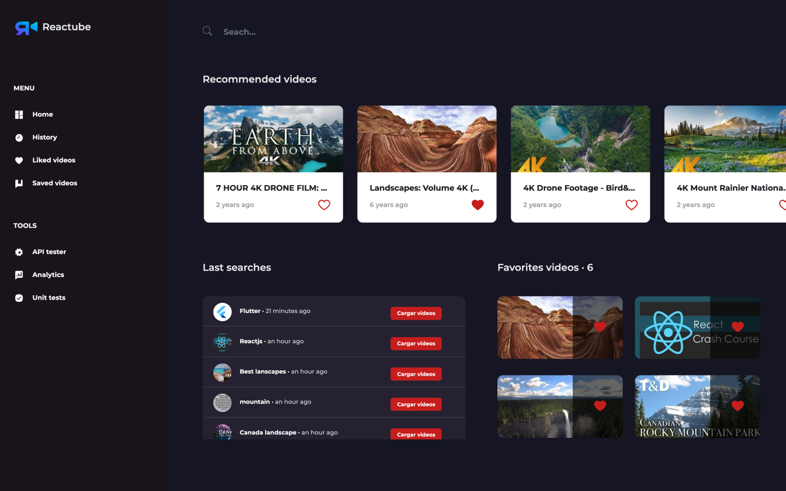
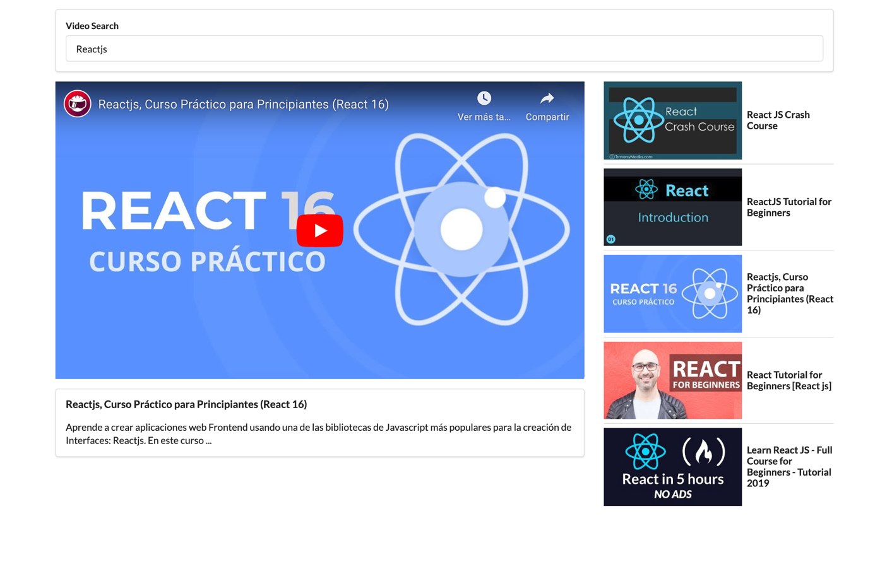
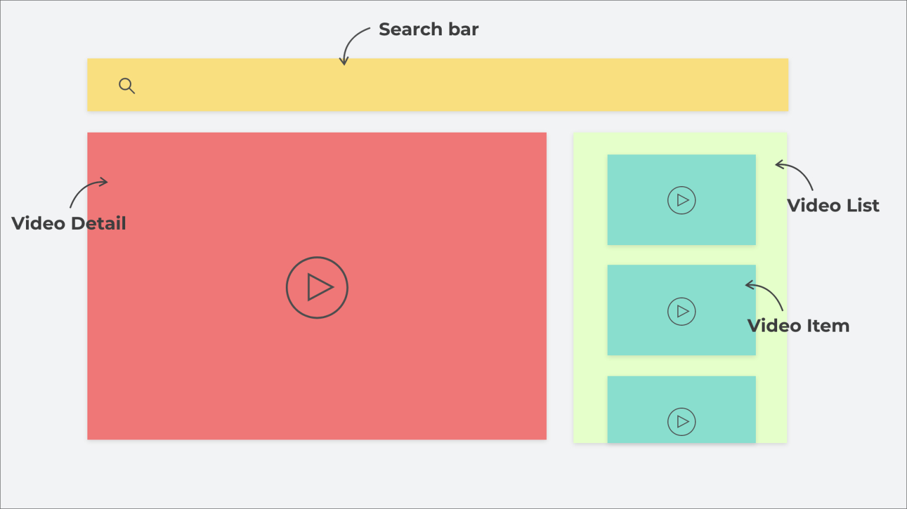
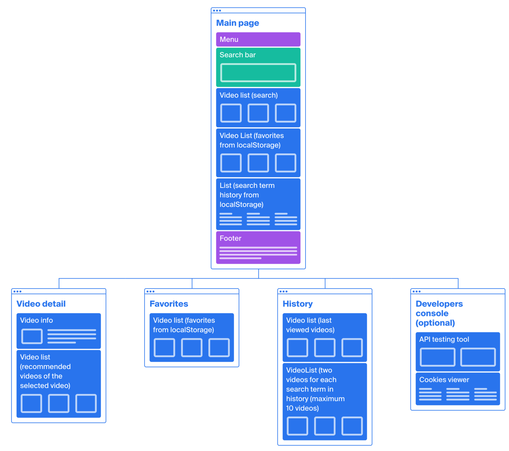
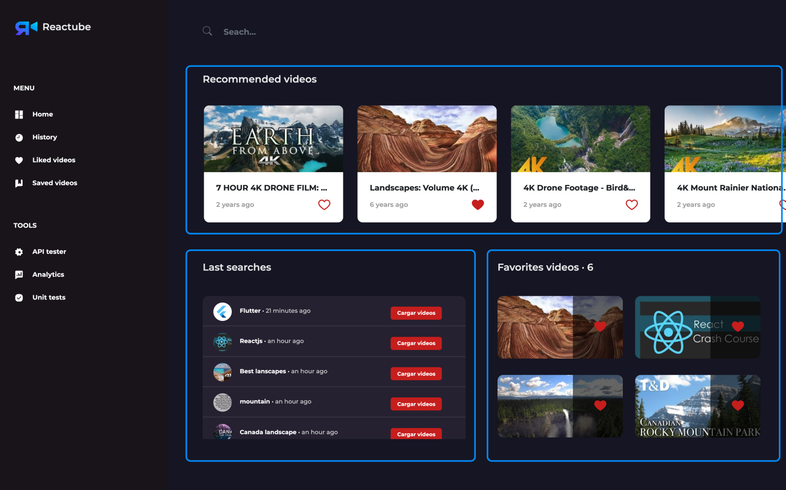
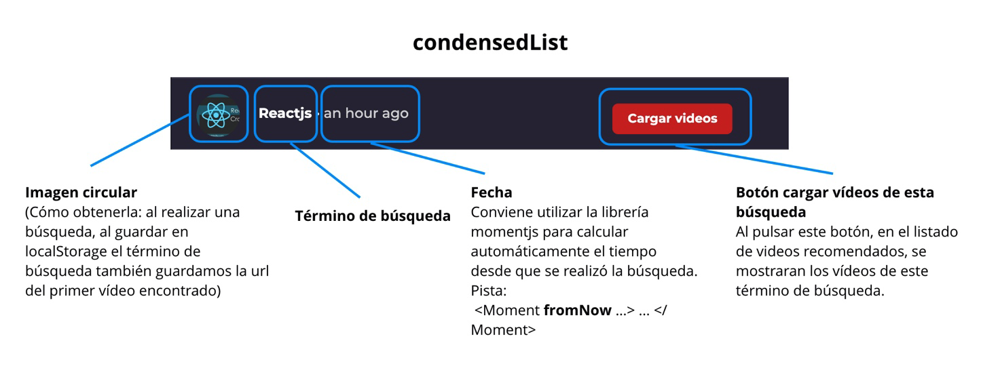

## Descripció

L'alumne pot triar entre fer un projecte lliure que li interessi molt o bé realitzar el projecte proposat:

- Si es tria el projecte lliure, un cop definida la temàtica i les funcionalitats de la mateixa, conjuntament amb el professor es definirà l'enfocament de el desenvolupament així com les tasques concretes per a la consecució d'aquesta app. La part bona d'aquesta elecció és que l'alumne a més de treballar en un tema que li interessa molt, el que augmenta la seva motivació.

- Si en canvi s'escull un exercici proposat, s'hauran d'anar completant els apartats de l'enunciat en PDF adjunt. L'exercici està pensat perquè a l'començament sigui més fàcil, amb més ajudes (pistes i consells en l'enunciat), i conforme es va avançant, s'incrementa la dificultat i a més es redueix l'ajuada, amb l'objectiu que l' alumne aprengui a desenvolupar per si mateix funcionalitats.

<u>Descripció del projecte proposat</u>

Farem la nostra pròpia versió de youtube, consumint vídeos reals mitjançant la API que proporciona google:

**https://developers.google.com/youtube/v3/docs?hl=es**

Abans de començar convé llegir per damunt la documentació de la API de YouTube per a veure queofereix.

En aquesta aplicació es podran buscar vídeos, hi haurà gestió de favorits, historial de cerques i detall de vídeo amb els seus vídeos relacionats:

## Nivell 1
<u>Abast d'aquest nivell</u>

Ens trobem en la primera fase del projecte, on muntarem la base, carregant vídeos de la API de YouTube i mostrant-los per pantalla.

Més endavant, en la fase 2, modificarem la navegació de l'aplicació iimplementarem funcionalitats com favorits, historial de cerca...

Aquest és l'aspecte que tindrà la nostra web una web que finalitzarem aquesta primera fase:

###

<u>Context</u>

Has començat a treballar **en una empresa com a programador** Frontend júnior. L'equip en el qual t'integraràs són 4 programadors frontend sènior, un responsable Frontend, 3 programadors Backend, el CTO (de l'anglès Chief Technical Officer) i el CEO (Chief Executive Officer).

L'empresa ha creat una **plataforma educativa** (tipus moodle) que ofereix a diferents clients, sent la seva principal font d'ingressos. Com és lògic, tens por a no complir amb les expectatives posades en tu, per la qual cosa vols treballar força bé per a causar molt bona impressió.

Et convoquen per a una reunió per a determinar les teves pròximes tasques i encaix en l'equip. T'expliquen que molts clients demanen una versió «lite» del producte, una plataforma de vídeos col·laborativa, simple i sense totes les opcions extra del producte principal. 

A causa d'això, i al fet que tots els programadors estan molt ocupats ja que s'està llançant una nova release del producte, **et demanen que duguis a terme una prova de concept****e**, per a poder fer una demostració als clients interessats. Al no disposar de vídeos, et demanen que consumar la API de YouTube temporalment.

Els **requisits** que et comuniquen d'aquesta primera fase són els següents:

- Mostrar un cercador, que permeti a l'usuari introduir el terme de cerca.

- Quan l'usuari introdueix un terme de cerca i prem el botó buscar, es mostrarà el llistat de

vídeos de la cerca realitzada, en la part dreta de la pantalla.

- Quan se selecciona un vídeo, mostrar-lo en gran per a poder visualitzar-lo, en la part esquerra de la pantalla.

Amb aquesta informació hauries de ser capaç de desenvolupar el projecte. Com portes poc temps en el món frontend, a continuació de descriuen els commits a dur a terme i es mostren ajudes de cada tasca.

<u>Arquitectura de l’aplicació frontend</u>

Abans de començar a programar, sempre és convenient crear un esquema dels components que

integraran l'aplicació, així com un diagrama que mostri la seva jerarquia. Això ajuda a enfocar millor el

projecte així com evitar possibles confusions.

Esquema components de l'aplicació:

Esquema amb el contingut de cada component:

###

Diagrama de jerarquia de components: a realitzar per l'alumne

Una vegada entès el projecte i el context en el qual s'emmarca, i tenint clar els components que cal

crear i la funcionalitat que busquem, és el moment de començar a programar. A continuació s'explica

cada commit que s'ha de dur a terme.

Nota: En realitzar una cerca, apareixerà el llistat de vídeos en la part dreta de la pantalla. Com encara

no hem seleccionat cap, la part esquerra de la pantalla apareixerà en blanc, per a evitar això pots

mostrar el detall del primer vídeo del llistat.

### - Exercici 1. Crear la base del projecte

Nom del commit: «initialCommit»

**Descripció**: crear l'estructura bàsica del projecte amb els paquets que creguem que utilitzarem.

**Tip 1**: és convenient usar el CLI create-react-app per a aquest propòsit. A més d'estalviar-nos temps,

crearà una estrutura de directoris estàndard.

**Tip 2**: és bon moment per a instal·lar els paquets que vagi a usar en el projecte. Per exemple, per a

facilitar-te la crida de les APIs de recomana intalar Axios.

**Tip 3**: També s'ha de pensar incloure una llibreria UI per a facilitar-te la creació de la interficie

### - Exercici 2. Component App

Nom del commit: «appComponent»

**Descripció**: s'ha de crear el component App, el més important de l'aplicació. Has de tenir en compte:

- Quins components inclourà (i quins són els props que proporcionarà a cadascun).

- Quins mètodes són necessaris que tingui.

- Quin és el seu state.

De moment pots fer que aquest component carregui els vídeos de YouTube i mostrar-los per consola

per a saber si s'ha realitzat bé la cerca.

El array de vídeos obtinguts de la API de youtube s'han de passar per props al component videoList.

Com es mostra en l'esquema de components, aquest component App.js conté tres components:

searchBar, videoList i videoDetail.

- Referència de API de YouTube:

https://developers.google.com/youtube/v3/docs

- Exemples de cridas API de Youtube:

https://developers.google.com/youtube/v3/sample_requests

**Nota**: Intenta resoldre la cerca de vídeos usant la API deYouTube sense l'ajuda d'un tutorial (tipus

"buscar vídeos de youtube amb react i axios"), en un futur et tocarà consumir APIs pitjors

documentades. És una oportunitat per a aprendre a consumir dades d’una API.

**Tip 1**: com hauràs pogut comprovar en molts tutorials, normalment hi ha un component que és el que

conté l'estat general de l'aplicació, els mètodes principals per a dinamitzar-la així com és el que inclou a

la resta de components o el routing. El component App serà aquest component principal.

**Tip 2**: en aquest component necessitaràs dos mètodes: «handleSubmit» i «handleVideoSelect»:

- «handleSubmit> és el mètode que s'executarà quan es realitzi una cerca, el qual acceptarà un string (.

El contingut d'aquest mètode és l'anomenada a la API de youtube i el seu guardat posterior en el state.

- «handleVideoSelect» s'executarà quan se seleccioni un vídeo del llistat. El únic del que s'encarregarà

és modificar l'estat.

###

**Code Snippet 1**. STATE:

state =

{

    videos: [ ],

    selectedVideo: null

}

**Code Snippet 2**. Crida a API youtube des de App.js quan es realiza una cerca:

import youtube from '../apis/youtube';

…

handleSubmit = async (termFromSearchBar) => {

...

    const response = await youtube.get('/search', {

        params: {

            q: termFromSearchBar

        }

    })

…

}

**Code Snippet 3**. Part del codi de apis/youtube.js:

...

export default axios.create({

    baseURL: ...,

    params: {

        part: ... ,

        maxResults: ... ,

       key: ...

        ...

    }

})

...

### - Exercici 3. Component SearchBar

Nom del commit: «searchBarComponent»

Descripció: una vegada creat el component principal amb el seu estat i mètodes, anirem creant els

altres components. Començarem per la barra de cerca.

Tip 1: aquest component rep com paràmetres el event handleSubmit. S'haurà d'executar handleSubmit

quan es realitza una cerca. Recorda handleSubmit és un mètode del component pare.

**Code Snippet** 1:

<form onSubmit={this.handleSubmit} ...>

    

        ...

        <input onChange={this.handleChange} value=..../>

    

</form>

### - Exercici 4. Component VideoList

Nom del commit: «videoListComponent»

Descripció: anem amb el següent component. Aquest component ha de mostrar llistat de vídeos que

s'han carregat mitjançant la API de YouTube quan es realitza una cerca.

**Tip 1**: recorda, segons l'esquema de l'aplicació, que aquest component conté un altre: videoItem, el

qual mostra la imatge i el nom del vídeo.

**Tip 2**: Quan es prem un dels vídeos del llistat s'ha de carregar aquest vídeo en videoDetail, per la qual

cosa caldrà passar per props un event al component videoItem.

**Tip 3**: aquest component pot ser stateless, per tant, no fa falta que sigui una classe.

**Code Snippet 1**:

const VideoList = ...

...

const renderedVideos = videos.map((video) => {

    return <VideoItem ...

    ...

return 
 {renderedVideos} 

### - Exercici 5. Component VideoItem

Nom del commit: «videoItemComponent»

**Descripció**: una vegada realitzat el llistat de vídeos, falta crear el component videoItem perquè pot renderitzar-se aquest llistat.

Ja hauries de ser capaç de realitzar aquest component, sempre seguim el mateix procés:

- Fa falta que tingui state?

- Què props o paràmetres té?

- Què és el que ha de fer aquest component?

- Conté a altres components?

### - Exercici 6. Component VideoDetail

Nom del commit: «videoDetailComponent»

**Descripció**: ja només queda implementar l'últim component. Recorda't que ha de contenir el títol i la descripció del vídeo.

## Nivell 2

Una vegada acabada la primera fase del projecte, fas una demo a l'equip per a mostrar els teus avanços i perquè puguin donar el seu punt de vista en el desenvolupament del projecte: **ja has aconseguit connectar la teva aplicació amb la API de YouTube**, mostrar els resultats de cerca en un llistat i poder seleccionar els vídeos.

La demo ha sortit molt bé i l'equip i el cap estan molt contents amb tu, tant que organitzaran una demo amb un potencial client en una setmana. Per a aquesta demo **et demanen que desenvolupis un dashboard on es puguin visualitzar totes les funcionalitats de l'aplicació en una única pantalla** (de fet, és una tendència en desenvolupament UX, reduir el nombre de pantalles i simplificar la navegació, que l'usuari fàcilment pugui accedir a allò que cerca). En aquesta pantalla es podrà visualitzar els vídeos recomanats, l'historial dels termes de cerca i els vídeos guardats en favorits. Més endavant s'explicarà detalladament cadascuna d'aquestes funcionalitats.

A més d'aquesta pantalla principal, **et demanen que en clicar sobre un vídeo es mostri el detall de vídeo en una pantalla a part**, i que en aquesta pantalla apareguin els vídeos relacionats (cal consultar API de YouTube per a saber com buscar vídeos relacionats).

Finalment, el teu cap et demana que si és possible **implementis un menú lateral que porti a les pantalles de l'aplicació** (caldrà crear aquestes pantalles, com a historial, favorits, vídeos guardats… ), ja que en la pantalla principal només es mostra una petita part de cada funcionalitat, però és necessari crear una pàgina completa per a cadascuna d'elles (veuràs que reutilitzant els components de la pantalla principal i el routing serà molt senzill i ràpid ampliar l'aplicació).

<u>Planificació</u>

El millor punt de partida per a començar a organitzar el treball, són les notes preses en la reunió (és molt recomanable prendre notes de totes les reunions, guardant-lo en el núvol, bé sigui google docs, evernote o similar, posant la data i assistents).

Primer de tot, enumerarem tot el treball a realitzar, per a després crear les tasques concretes per a dur-lo a terme:

1. Pantalla principal, on es puguin visualitzar:

a. Llistat vídeos recomanats/oposats: quan es realitza una cerca canviael llistat a vídeos oposats. Ja mirarem com obtenir els vídeos recomanats.

b. Llistat amb l'historial de termes de cerca. Senzill, es tractarà d'anar guardant en localStorage les cerques que va realitzant l'usuari per a mostrar-lo per pantalla.

c. Llistat de vídeos favorits. Igual que farem amb els termes de cerca, podem guardar els vídeos favorits en localStorage.

2. Menu lateral. Aquest component contindrà els links a les diferents pantalles de l'aplicació.

3. Pantalla de favorits. Aquesta pantalla és molt senzilla, ja que és una versió a pantalla completa del, llistat de vídeos favorits que ja vam mostrar en la poantalla principal.

4. Pantalla d'historial. En aquesta pantalla podrem mostrar el llistat amb l'historial dels termes de cerca mostrat en la pantalla principal, i un altre llistat que contingui els últims vídeos vists.

5. Pantalla API tester (opcional). Eina per a poder realitzar queries a la API de YouTube i poder visualitzar el resultat.

Ja tenim clar tot el que s'ha de programar, és el moment de dividir el treball en tasques concretes de curta durada, recomanable que no superin les 8 hores. Aquest treball convé fer-lo abans del Sprint Planning amb l'equip (sobretot amb el Scrum Màster), on es determinen les tasques i el temps necessari per a la consecució per a cadascuna d'elles (més informació en https://plan.io/blog/sprint-planning/).

Tasques concretes a realitzar ordenades (més endavant es detallarà cada tasca):

o Crear la pantalla de detall de vídeo, deixant en la pantalla principal únicament el llistat

de vídeos oposats en realitzar una cerca.

o Com en obrir la web encara no s'ha realitzat cap cerca, la pantalla apareix enblanc, mostrar vídeos recomanats quan l'usuari encara no ha realitzat una cerca.

o Mostrar en la pantalla principal el llistat amb l'historial dels termes de cerca.

o Implementar el botó de “afegir a favorits”. Aquest botó es mostrarà en tots els vídeos de l'aplicació (en els vídeos del llistat de vídeos oposats, en el detall de vídeo i en els vídeos relacionats).

o Mostrar el llistat de vídeos favorits en la pantalla principal.

o Muntar les rutes de l'aplicació en el component principal.

o Crear el menú lateral que portarà a les diferents pantalles.

o Crear la pantalla d'historial.

o Implementar la pantalla de favorits.

Ara seria convenient que a cada tasca li assignessis el temps estimat de realització, per a després comparar amb el temps real, podent fer una reflexió de per què no has trigat el que pensaves, la qual cosa t'ajudarà a millorar sabent què és el que et frena, a més d'aprendre a estimar millor les tasques.

<u>Navegació de l'aplicació frontend</u>

Una vegada que es té clara la planificació i tots els passos que hem de seguir per a complir els objectius, convé realitzar l'esquema de navegació de l'aplicació, on es mostrin tots els components que necessitarem, que ens serveixi de “mapa” quan estiguem embardissats programant. (un edifici mai de construiria sense plans veritat? Els paletes estarien confosos sense una guia clara, perquè aquí succeeix el mateix, contra més estudi previ facis abans de començar, menys et costarà el desenvolupament).

“Si tingués una hora per a resoldre un problema gastaria 55 minuts pensant sobre el problema i 5 minuts pensant sobre la solució” - Albert Einstein.

A més de realitzar l'esquema de navegació de l'aplicació, és convenient fer el diagrama de jerarquia de components.

L'esquema amb la navegació de l'aplicació i els components que compondran cada pantalla és el següent (desenvolupat amb octopus.do, molt ràpid prototipar aplicacions):

Ara que hem plasmats els requeriments en un esquema, queda molt més clar tot el treball que hem de realitzar.

Podem extreure diverses conclusions repassant l'esquema:

- Encara que sembli gran l'aplicació, no fa falta crear molts components, ja que els reutilitzem i ja tenim diversos creats de la fase 1.

- El component “videoList” és el que més es reutilitzar, res menys que 7 vegades.

Informació addicional dels components

En aquesta fase del projecte, tindràs la llibertat per a crear els commits i branques de git que consideris oportunes, però insistir que programar és només el 50%,  l'altre 50% és:

- Saber **comunicar i argumentar els desenvolupaments realitzats**.

- Tenir el **desenvolupament ben ordenat en commits** en una branca ben sincronitzada amb la de l'equip, per a evitar conflictes de codi (podem passar molt de temps resolent conflictes, Gitkraken és una eina que pot ajudar-nos)

- Crear el **readme** amb les [instruccions](https://itacademy.barcelonactiva.cat/mod/forum/view.php?id=3578 "Instruccions") per a arrencar el projecte, funcionalitats… i realitzar la **documentació** de les funcionalitats.

### - Exercici 7. Detall de video

Com s'ha comentat anteriorment, la primera tasca és separar la pantalla principal realitzada en la fase 1 d'aquest projecte en dos: llistat de vídeos oposats i detall de vídeo.

Aquesta operació no comporta dificultat, potser la part que ens requereix més temps és llegir la documentació de la API de YouTube per a aconseguir carregar els vídeos relacionats al vídeo seleccionat, i implementar-lo en la nostra web.

A aquesta pantalla es podrà accedir prement sobre qualsevol vídeo de l'aplicació. Conté dos blocs:

- El vídeo amb el seu títol i descripció.

- Els vídeos relacionats. S'ha de consultar la documentació de la API de YouTube per a implementar la càrrega de vídeos relacionats.

### - Exercici 8. Component principal

Per a poder visualitzar totes les funcionalitats en una mateixa pantalla, i millorar l'experiència d'usuari, desenvoluparem un dashboard molt complet, on es motrará en un llistat els vídeos recomanats o els vídeos oposats quan es realitzi una cerca, el llistat que mostri els últims termes de cerca i finalment els vídeos guardats com a favorits:

Detall d'un element de l'historial de cerca:

Recurs d'interès: react-moment, https://www.npmjs.com/package/react-moment. Ens facilitarà el treball de calcular fa quant es va realitzar la cerca. Es tracta de comparar el moment en què es va realitzar aquesta cerca (aquesta dada l'haurem d'haver guardat en localStorage) amb el moment actual. Com es comenta en la imatge, es podrà usar <Moment fromNow> per a obtenir aquest valor fàcilment.

## Nivell 3

### - Exercici 9

Crear menu lateral esquerre (si no ho has creat anteriorment). 

Implementar les rutes de l'aplicació, i mitjançant els links del menu lateral es pugui accedir a les diferents vistes.

Com de moment només tens la vista de dashboard i detall de vídeo, hauràs de crear la vista de favorits i historial ()amb aquestes dues és suficient, encara que pot fer tantes com vulguis!)
